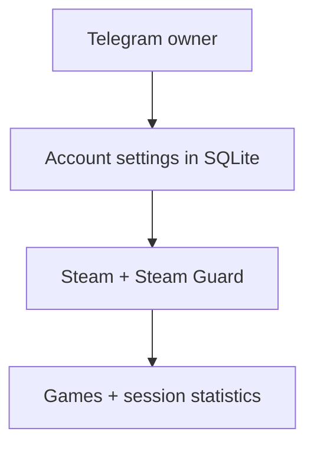

# Steam Hour Booster

[Русский](README.md) · [English](README_EN.md)

Telegram-панель для управления Steam-аккаунтами: запуск выбранных игр, ввод Steam Guard и учёт времени сессий. Доступ ограничен владельцем; настройки и статистика хранятся в SQLite.

## Требования

- Python 3.14;
- Telegram-бот, созданный через [@BotFather](https://t.me/BotFather);
- числовой Telegram ID владельца;
- Steam-аккаунты, которыми вы вправе управлять;
- системная среда, в которой устанавливается `steam[client]`.

## Быстрый старт

```powershell
git clone https://github.com/soroka01/HourBooster.git
cd HourBooster
```

При первом запуске введите токен Telegram-бота и ID владельца в консоли. Они сохранятся в SQLite; аккаунты добавляются через Telegram.

### Windows

[start.bat](start.bat) создаёт `.venv`, устанавливает зависимости и запускает бота:

```powershell
.\start.bat
```

Ручной эквивалент:

```powershell
python -m venv .venv
.\.venv\Scripts\python.exe -m pip install -r requirements.txt
.\.venv\Scripts\python.exe HourBooster.py
```

### Linux и macOS

```bash
python3 -m venv .venv
.venv/bin/python -m pip install -r requirements.txt
.venv/bin/python HourBooster.py
```

## Как это работает



## Интерфейс

При неожиданном разрыве активной Steam-сессии или событии Steam о выходе из игры бот отправляет владельцу отдельное сообщение и пишет причину в консоль. Открытая карточка остаётся на месте. Ручная остановка буста и штатное закрытие скрипта уведомлений не вызывают. При временной недоступности Telegram отправка повторяется.

При прерывании игры учёт времени приостанавливается, а подключение к Steam сохраняется. Выход из игры определяется после подтверждённого Steam игрового статуса; блокировка игры другой сессией также вызывает уведомление. Видимость профиля и настройки приватности для этой проверки не используются.

```text
/start
  └─ список аккаунтов
       ├─ ➕ добавить аккаунт
       └─ открыть карточку
            ├─ 🚀 запустить / ⏹ остановить
            ├─ 🔐 ввести Steam Guard или email code
            ├─ 📊 статистика
            ├─ ✏️ изменить название, login, пароль или App ID
            └─ 🗑 удалить с подтверждением
```

| Команда | Действие |
| --- | --- |
| `/start` | Открыть список аккаунтов |
| `/menu` | Открыть список аккаунтов |
| `/cancel` | Отменить форму или ввод auth code |

## Настройки

Настройки Telegram хранятся в таблице `app_settings` той же SQLite-базы, что и аккаунты. Для изменения токена или ID владельца остановите бота и выполните:

```powershell
.\.venv\Scripts\python.exe HourBooster.py --setup
```

Токен вводится открыто; его можно вставить через Ctrl+V. После сохранения команда завершится; запустите бота обычным способом. По умолчанию используется `data/hour_booster.sqlite3` относительно каталога проекта. Другую базу можно выбрать ключом `--database PATH`, в том числе вместе с `--setup`.

## Локальные данные и безопасность

SQLite по умолчанию находится в `data/hour_booster.sqlite3` и содержит:

- токен Telegram-бота и ID владельца;
- названия аккаунтов, Steam logins и **plaintext passwords**;
- списки App ID;
- суммарное время и отметку `active_since`;
- историю завершённых sessions;
- ID control message для каждого Telegram chat.

Рекомендации:

- ограничьте доступ к каталогу проекта средствами операционной системы;
- не помещайте базу в публичные backups;
- отзовите Telegram token при подозрении на утечку;
- не полагайтесь на удаление messages как на единственную защиту credentials;
- перед удалением аккаунта сделайте backup, если нужна его статистика.

## Как считается время

Локальный timer начинается только после `EResult.OK` от Steam. При обычной остановке или disconnect длительность до текущего момента добавляется в `total_boost_seconds`, а session помечается завершённой.

> [!WARNING]
> При обычной остановке бот завершает Steam workers и фиксирует время сессий. При аварийном завершении, если в SQLite остаётся `active_since`, следующий запуск закрывает такую session своим текущим временем. Поэтому downtime между остановкой процесса и следующим запуском может попасть в статистику. Эти значения — локальный учёт работы бота, а не независимая или гарантированно точная Steam playtime.

## Обновление

Сохраните резервную копию SQLite, выполните `git pull` и перезапустите бота. Существующие аккаунты и статистика остаются в БД. Если настройки Telegram ещё не сохранены в ней, укажите их при первом запуске. Импорт аккаунтов из INI удалён.

## Ограничения

- Обновляется только открытая карточка с интервалом не меньше 2 секунд.
- Названия игр загружаются из Steam и кэшируются; при недоступности названия отображается ID. Длинные названия сокращаются до лимита сообщения.
- Вход выполняется через современный Steam AuthenticationService. Пароль передаётся в RSA-зашифрованном виде, а Steam-клиент входит по refresh token.
- Подтвердите запрос Steam Hour Booster в приложении Steam или введите код через бота. Запрос действует до 5 минут. Токены не сохраняются в БД и не выводятся в сообщения.
- Доступность входа зависит от Steam; семейные ограничения на игры продолжают действовать.

## Решение проблем

| Симптом | Что проверить |
| --- | --- |
| Ошибка конфигурации | Повторите `HourBooster.py --setup` |
| Нет доступа к боту | Совпадает ли Telegram ID с настройками SQLite |
| Steam отклоняет login | Credentials и требуемый Guard/email code |
| Сессия остаётся в `connecting` | Network access, Steam availability и logs в консоли |
| `TelegramNetworkError` / `ServerDisconnectedError` при обновлении экрана | Это связь с Telegram. Бот повторяет обновление с паузой до 60 секунд и пишет о восстановлении в консоль; Steam-сессии не перезапускаются. При лимите Telegram учитывается `retry_after` |
| Статистика выросла после restart | Ограничение recovery незакрытой session выше |
| Не ставится `steam[client]` | Python version и platform build dependencies |

## Лицензия

[MIT](LICENSE).

## Поддержка

Можно [форкнуть репозиторий](https://github.com/soroka01/HourBooster/fork) и доработать под себя. Если проект пригодился, поставьте [Star](https://github.com/soroka01/HourBooster) — так я увижу, что он был кому-то полезен.

---

with love ❤️
