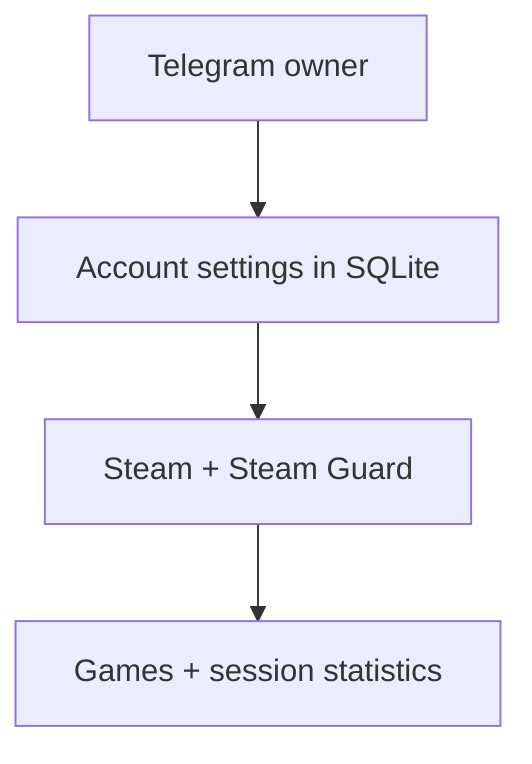

# 🎮 Steam Hour Booster

> Telegram-панель для управления Steam-аккаунтами: запуск игр, ввод Steam Guard и учёт времени сессий.

🌐 **Язык / Language:** [Русский](README.md) · [English](README_EN.md)


## 📌 Обзор

Steam Hour Booster — Telegram-бот для управления Steam-аккаунтами: запускает выбранные игры, принимает коды Steam Guard и ведёт учёт времени сессий. Доступ ограничен владельцем; настройки и статистика хранятся в SQLite.

> [!WARNING]
> Пароли и токен бота хранятся в базе в **открытом виде**. См. [Безопасность и приватность](#-безопасность-и-приватность).

> [!NOTE]
> Интерфейс бота — на русском языке.

## ✨ Возможности

- Управление аккаунтами целиком через Telegram: добавление, редактирование, удаление с подтверждением.
- Запуск и остановка игр по App ID; названия игр загружаются из Steam и кэшируются.
- Вход через Steam AuthenticationService: подтверждение в приложении Steam или код Guard/email через бота.
- Кастомное название в статусе Steam (отображается как сторонняя игра перед настроенными App ID).
- Статистика по каждому аккаунту и история завершённых сессий.
- Уведомления владельцу о неожиданном прерывании Steam-сессии или выходе из игры.
- Устойчивое обновление карточки: повторные попытки после временных сетевых ошибок Telegram.

## 🏗️ Как это работает


```mermaid
flowchart TD
    A["Telegram owner"] --> B["Account settings in SQLite"]
    B --> C["Steam + Steam Guard"]
    C --> D["Games + session statistics"]
```

- **Учёт времени.** Локальный timer начинается только после `EResult.OK` от Steam. При обычной остановке или disconnect длительность добавляется в `total_boost_seconds`, а session помечается завершённой.
- **Прерывания.** При прерывании игры учёт времени приостанавливается, а подключение к Steam сохраняется. Выход из игры определяется после подтверждённого Steam игрового статуса; блокировка игры другой сессией также вызывает уведомление. Видимость профиля и настройки приватности для этой проверки не используются.
- **Уведомления.** При неожиданном разрыве активной Steam-сессии или событии выхода из игры бот отправляет владельцу отдельное сообщение и пишет причину в консоль; открытая карточка остаётся на месте. Ручная остановка и штатное закрытие скрипта уведомлений не вызывают. При временной недоступности Telegram отправка повторяется.
- **Кастомная игра.** Остановите аккаунт, откройте **Настройки → 🎮 Кастомная игра**, введите одну строку до 64 символов и снова запустите аккаунт. Название отправляется первым как сторонняя игра, затем идут настроенные App ID в исходном порядке. У каждого аккаунта своё название; **Убрать кастомную игру** возвращает обычный список. Это статус стороннего приложения: `.exe` не запускается, библиотечные игры не переименовываются. Видимость по-прежнему определяют настройки приватности Steam ([инструкция Steam о сторонних играх](https://help.steampowered.com/en/faqs/view/4B8B-9697-2338-40EC)).

> [!WARNING]
> При обычной остановке бот завершает Steam workers и фиксирует время сессий. При аварийном завершении, если в SQLite остаётся `active_since`, следующий запуск закрывает такую session своим текущим временем, поэтому downtime между остановкой процесса и следующим запуском может попасть в статистику. Эти значения — локальный учёт работы бота, а не независимая или гарантированно точная Steam playtime.

## 🚀 Быстрый старт

### Требования

- Python 3.14;
- Telegram-бот, созданный через [@BotFather](https://t.me/BotFather);
- числовой Telegram ID владельца;
- Steam-аккаунты, которыми вы вправе управлять;
- системная среда, в которой устанавливается `steam[client]`.

### Установка

```powershell
git clone https://github.com/soroka01/HourBooster.git
cd HourBooster
```

### Настройка

Файл `.env` не нужен. При первом запуске введите токен Telegram-бота и ID владельца в консоли; они сохранятся в SQLite. Steam-аккаунты добавляются через Telegram.

### Запуск

Windows: [start.bat](start.bat) создаёт `.venv`, устанавливает зависимости и запускает бота.

```powershell
.\start.bat
```

Ручной эквивалент:

```powershell
python -m venv .venv
.\.venv\Scripts\python.exe -m pip install -r requirements.txt
.\.venv\Scripts\python.exe HourBooster.py
```

Linux и macOS:

```bash
python3 -m venv .venv
.venv/bin/python -m pip install -r requirements.txt
.venv/bin/python HourBooster.py
```

## ⚙️ Конфигурация

Настройки Telegram хранятся в таблице `app_settings` той же SQLite-базы, что и аккаунты. Для изменения токена или ID владельца остановите бота и выполните:

```powershell
.\.venv\Scripts\python.exe HourBooster.py --setup
```

Токен вводится открыто; его можно вставить через Ctrl+V. После сохранения команда завершится; запустите бота обычным способом.

**Параметры командной строки**

| Параметр | По умолчанию | Описание |
| --- | --- | --- |
| `--setup` | выкл. | Сохранить настройки Telegram (токен, ID владельца) в SQLite и выйти |
| `--database PATH` | `data/hour_booster.sqlite3` (относительно каталога проекта) | Использовать другую SQLite-базу; работает вместе с `--setup` |

**Команды бота**

| Команда | Действие |
| --- | --- |
| `/start` | Открыть список аккаунтов |
| `/menu` | Открыть список аккаунтов |
| `/cancel` | Отменить форму или ввод auth code |

**Карточка аккаунта**

```text
/start
  └─ список аккаунтов
       ├─ ➕ добавить аккаунт
       └─ открыть карточку
            ├─ 🚀 запустить / ⏹ остановить
            ├─ 🔐 ввести Steam Guard или email code
            ├─ 📊 статистика
            ├─ ✏️ изменить название, login, пароль, App ID или кастомную игру
            └─ 🗑 удалить с подтверждением
```

**Обновление:** сохраните резервную копию SQLite, выполните `git pull` и перезапустите бота. Существующие аккаунты и статистика остаются в БД. Импорт аккаунтов из INI удалён.

## 🗂️ Структура проекта

```text
HourBooster.py          # точка входа, аргументы CLI (--setup, --database)
start.bat               # запуск в Windows: .venv, зависимости, старт
requirements.txt        # aiogram, steam[client]
src/
├── config_manager.py   # работа с настройками Telegram
├── bot/                # Telegram-слой: контроллер, UI, состояния, проверка доступа, уведомления
├── steam/              # вход в Steam, управление сессиями, названия игр
└── storage/            # база данных SQLite
data/                   # SQLite-база времени выполнения (создаётся при запуске)
```

## 🔒 Безопасность и приватность

SQLite по умолчанию находится в `data/hour_booster.sqlite3` и содержит:

- токен Telegram-бота и ID владельца;
- названия аккаунтов, Steam logins и **plaintext passwords**;
- списки App ID и кастомные названия игр;
- суммарное время и отметку `active_since`;
- историю завершённых sessions;
- ID control message для каждого Telegram chat.

Рекомендации:

- ограничьте доступ к каталогу проекта средствами операционной системы;
- не помещайте базу в публичные backups;
- отзовите Telegram token при подозрении на утечку;
- не полагайтесь на удаление messages как на единственную защиту credentials;
- перед удалением аккаунта сделайте backup, если нужна его статистика.

Пароль передаётся Steam в RSA-зашифрованном виде, затем Steam-клиент входит по refresh token. Токены не сохраняются в БД и не выводятся в сообщения.

## ⚠️ Ограничения

- Обновляется только открытая карточка с интервалом не меньше 2 секунд.
- Названия игр загружаются из Steam и кэшируются; при недоступности названия отображается ID. Длинные названия сокращаются до лимита сообщения.
- Подтвердите запрос Steam Hour Booster в приложении Steam или введите код через бота в течение 5 минут.
- Доступность входа зависит от Steam; семейные ограничения на игры продолжают действовать.

### Решение проблем

| Симптом | Что проверить |
| --- | --- |
| Ошибка конфигурации | Повторите `HourBooster.py --setup` |
| Нет доступа к боту | Совпадает ли Telegram ID с настройками SQLite |
| Steam отклоняет login | Credentials и требуемый Guard/email code |
| Сессия остаётся в `connecting` | Network access, Steam availability и logs в консоли |
| `TelegramNetworkError` / `ServerDisconnectedError` при обновлении экрана | Это связь с Telegram. Бот повторяет обновление с паузой до 60 секунд и пишет о восстановлении в консоль; Steam-сессии не перезапускаются. При лимите Telegram учитывается `retry_after` |
| Статистика выросла после restart | Ограничение recovery незакрытой session выше |
| Не ставится `steam[client]` | Python version и platform build dependencies |

## 📄 Лицензия

[MIT](LICENSE).

## 💬 Поддержка

Можно [форкнуть репозиторий](https://github.com/soroka01/HourBooster/fork) и доработать под себя. Если проект пригодился, поставьте [Star](https://github.com/soroka01/HourBooster) — так я увижу, что он был кому-то полезен.

---

with love ❤️
