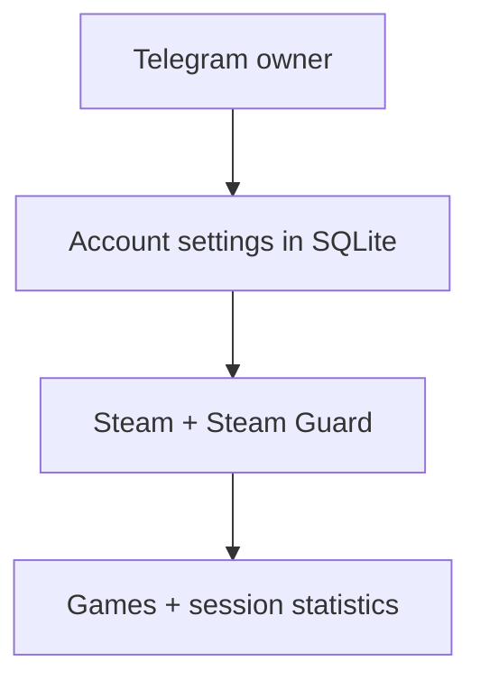

# Steam Hour Booster

[Русский](README.md) · [English](README_EN.md)

Telegram panel for managing Steam accounts: running selected games, entering Steam Guard codes, and tracking session time. Access is restricted to the owner; settings and statistics are stored in SQLite.

## Requirements

- Python 3.14;
- a Telegram bot created through [@BotFather](https://t.me/BotFather);
- the owner's numeric Telegram user ID;
- Steam accounts you are authorized to manage;
- an environment where `steam[client]` can be installed.

## Quick start

```powershell
git clone https://github.com/soroka01/HourBooster.git
cd HourBooster
```

On first launch, enter the Telegram bot token and owner ID in the console. They are saved in SQLite; add Steam accounts through Telegram.

### Windows

[start.bat](start.bat) creates `.venv`, installs dependencies, and starts the bot:

```powershell
.\start.bat
```

Manual equivalent:

```powershell
python -m venv .venv
.\.venv\Scripts\python.exe -m pip install -r requirements.txt
.\.venv\Scripts\python.exe HourBooster.py
```

### Linux and macOS

```bash
python3 -m venv .venv
.venv/bin/python -m pip install -r requirements.txt
.venv/bin/python HourBooster.py
```

## How it works



## Interface

An unexpected active Steam session disconnect or a Steam game-exit event sends the owner a separate message and logs the reason to the console. The open card stays in place. Manually stopping boost or shutting down the script normally does not send alerts. Delivery retries while Telegram is temporarily unavailable.

When gameplay is interrupted, time accounting pauses while the Steam connection stays open. Game-exit detection requires a previously confirmed Steam playing state; another session blocking gameplay also triggers an alert. Profile visibility and privacy settings are not used for this check.

To set a custom Steam status name, stop the account and open **Settings → 🎮 Custom game** (the bot UI is in Russian). Enter one line of up to 64 characters, then start the account again. The custom name is sent first as a non-Steam game, followed by all configured App IDs in their original order. Each account stores its own name in SQLite; **Remove custom game** restores the normal list.

This reports a non-Steam application status; it does not launch an `.exe` or rename library games. Steam privacy settings still control visibility. [Steam's non-Steam games guide](https://help.steampowered.com/en/faqs/view/4B8B-9697-2338-40EC).

```text
/start
  └─ account list
       ├─ ➕ add an account
       └─ open an account card
            ├─ 🚀 start / ⏹ stop
            ├─ 🔐 enter Steam Guard or email code
            ├─ 📊 statistics
            ├─ ✏️ edit title, username, password, or App IDs
            └─ 🗑 delete with confirmation
```

| Command | Action |
| --- | --- |
| `/start` | Open the account list |
| `/menu` | Open the account list |
| `/cancel` | Cancel a form or authentication-code input |

## Configuration

Telegram settings live in the `app_settings` table in the account database. Stop the bot before changing its token or owner ID:

```powershell
.\.venv\Scripts\python.exe HourBooster.py --setup
```

Token input is hidden. The command exits after saving; start the bot normally afterwards. The default is `data/hour_booster.sqlite3` relative to the project directory. Use `--database PATH` to select another database, including with `--setup`.

## Local data and security

By default, SQLite lives at `data/hour_booster.sqlite3` and contains:

- the Telegram bot token and owner ID;
- account titles, Steam usernames, and **plaintext passwords**;
- App ID lists;
- accumulated time and the `active_since` timestamp;
- completed-session history;
- the control-message ID for each Telegram chat.

Recommendations:

- restrict operating-system access to the project directory;
- keep the database out of public backups;
- revoke the Telegram token if exposure is suspected;
- do not rely on message deletion as the only credential protection;
- back up the database before account deletion if its statistics matter.

## Time accounting

The local timer starts only after Steam returns `EResult.OK`. On a normal stop or disconnect, elapsed time is added to `total_boost_seconds` and the session is marked complete.

> [!WARNING]
> Normal shutdown stops Steam workers and records session durations. After an unexpected termination, when SQLite still contains `active_since`, the next launch closes that session using the new current time. Downtime between process termination and restart can therefore be included in the statistics. These values are local bot accounting, not an independent or guaranteed-accurate Steam playtime source.

## Updating

Back up SQLite, run `git pull`, and restart the bot. Existing accounts and statistics remain in the database. If Telegram settings are not stored there yet, enter them on first launch. INI account import has been removed.

## Limitations

- Only the open card refreshes, at intervals of at least two seconds.
- Game names are fetched from Steam and cached; IDs remain visible when names are unavailable. Long names are shortened to fit the message limit.
- Login uses modern Steam AuthenticationService with an RSA-encrypted password, followed by a Steam client login using a refresh token.
- Approve the Steam Hour Booster request in Steam or submit a Guard/email code through the bot within 5 minutes. Tokens are not saved in SQLite or displayed in messages.
- Login availability depends on Steam; parental game restrictions still apply.

## Troubleshooting

| Symptom | Check |
| --- | --- |
| Configuration error | Run `HourBooster.py --setup` again |
| The bot denies access | Telegram user ID matches the SQLite settings |
| Steam rejects login | Credentials and the requested Guard/email code |
| A session remains `connecting` | Network access, Steam availability, and console logs |
| `TelegramNetworkError` / `ServerDisconnectedError` during screen refresh | This affects Telegram connectivity. Refresh retries with delays up to 60 seconds and logs recovery without restarting Steam sessions. Telegram rate limits use the server's `retry_after` |
| Statistics grow after restart | The interrupted-session recovery limitation above |
| `steam[client]` does not install | Python version and platform build dependencies |

## License

[MIT](LICENSE).

## Support

Feel free to [fork this repository](https://github.com/soroka01/HourBooster/fork) and adapt it. If it helped you, leave a [Star](https://github.com/soroka01/HourBooster) so I can see it was useful.

---

with love ❤️
