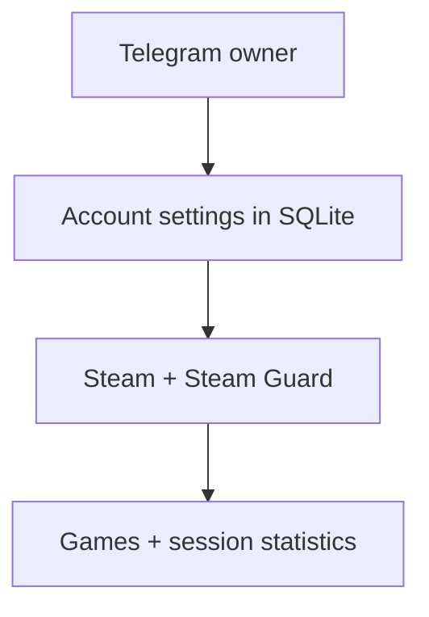

# 🎮 Steam Hour Booster

> Telegram control panel for Steam accounts: run games, enter Steam Guard codes, and track session time.

🌐 **Язык / Language:** [Русский](README.md) · [English](README_EN.md)


## 📌 Overview

Steam Hour Booster is a Telegram bot for managing Steam accounts: it runs selected games, accepts Steam Guard codes, and tracks session time. Access is restricted to the owner; settings and statistics are stored in SQLite.

> [!WARNING]
> Passwords and the bot token are stored in the database in **plaintext**. See [Security & privacy](#-security--privacy).

> [!NOTE]
> The bot UI is in Russian.

## ✨ Features

- Account management entirely through Telegram: add, edit, delete (with confirmation).
- Start and stop games by App ID; game names are fetched from Steam and cached.
- Login via Steam AuthenticationService: approve in the Steam app or enter a Guard/email code through the bot.
- Custom Steam status name (shown as a non-Steam game, listed before the configured App IDs).
- Per-account statistics and completed-session history.
- Owner alerts on unexpected Steam session interruption or game exit.
- Resilient live card refresh: retries after transient Telegram network errors.

## 🏗️ How it works


```mermaid
flowchart TD
    A["Telegram owner"] --> B["Account settings in SQLite"]
    B --> C["Steam + Steam Guard"]
    C --> D["Games + session statistics"]
```

- **Time accounting.** The local timer starts only after Steam returns `EResult.OK`. On a normal stop or disconnect, elapsed time is added to `total_boost_seconds` and the session is marked complete.
- **Interruptions.** When gameplay is interrupted, time accounting pauses while the Steam connection stays open. Game-exit detection requires a previously confirmed Steam playing state; another session blocking gameplay also triggers an alert. Profile visibility and privacy settings are not used for this check.
- **Alerts.** An unexpected active-session disconnect or a game-exit event sends the owner a separate message and logs the reason to the console; the open card stays in place. Manual stop and normal shutdown send no alerts. Delivery retries while Telegram is unavailable.
- **Custom game.** Stop the account, open **Settings → 🎮 Custom game**, enter one line of up to 64 characters, then start the account again. The name is sent first as a non-Steam game, followed by the configured App IDs in their original order. Each account stores its own name; **Remove custom game** restores the normal list. This reports a non-Steam application status; it does not launch an `.exe` or rename library games. Steam privacy settings still control visibility ([Steam's non-Steam games guide](https://help.steampowered.com/en/faqs/view/4B8B-9697-2338-40EC)).

> [!WARNING]
> Normal shutdown stops Steam workers and records session durations. After an unexpected termination, when SQLite still contains `active_since`, the next launch closes that session using the new current time, so downtime between termination and restart can end up in the statistics. These values are local bot accounting, not an independent or guaranteed-accurate Steam playtime source.

## 🚀 Quick start

### Requirements

- Python 3.14;
- a Telegram bot created through [@BotFather](https://t.me/BotFather);
- the owner's numeric Telegram user ID;
- Steam accounts you are authorized to manage;
- an environment where `steam[client]` can be installed.

### Installation

```powershell
git clone https://github.com/soroka01/HourBooster.git
cd HourBooster
```

### Configuration

No `.env` file is needed. On first launch, enter the Telegram bot token and owner ID in the console; they are saved in SQLite. Add Steam accounts through Telegram.

### Run

Windows: [start.bat](start.bat) creates `.venv`, installs dependencies, and starts the bot.

```powershell
.\start.bat
```

Manual equivalent:

```powershell
python -m venv .venv
.\.venv\Scripts\python.exe -m pip install -r requirements.txt
.\.venv\Scripts\python.exe HourBooster.py
```

Linux and macOS:

```bash
python3 -m venv .venv
.venv/bin/python -m pip install -r requirements.txt
.venv/bin/python HourBooster.py
```

## ⚙️ Configuration

Telegram settings live in the `app_settings` table of the same SQLite database as the accounts. Stop the bot before changing its token or owner ID:

```powershell
.\.venv\Scripts\python.exe HourBooster.py --setup
```

Token input is visible and supports pasting with Ctrl+V. The command exits after saving; start the bot normally afterwards.

**Command-line options**

| Option | Default | Description |
| --- | --- | --- |
| `--setup` | off | Save Telegram settings (token, owner ID) to SQLite and exit |
| `--database PATH` | `data/hour_booster.sqlite3` (relative to the project directory) | Use another SQLite database; works together with `--setup` |

**Bot commands**

| Command | Action |
| --- | --- |
| `/start` | Open the account list |
| `/menu` | Open the account list |
| `/cancel` | Cancel a form or authentication-code input |

**Account card**

```text
/start
  └─ account list
       ├─ ➕ add an account
       └─ open an account card
            ├─ 🚀 start / ⏹ stop
            ├─ 🔐 enter Steam Guard or email code
            ├─ 📊 statistics
            ├─ ✏️ edit title, username, password, App IDs, or custom game
            └─ 🗑 delete with confirmation
```

**Updating:** back up SQLite, run `git pull`, and restart the bot. Existing accounts and statistics remain in the database. INI account import has been removed.

## 🗂️ Project structure

```text
HourBooster.py          # entry point, CLI arguments (--setup, --database)
start.bat               # Windows launcher: .venv, dependencies, start
requirements.txt        # aiogram, steam[client]
src/
├── config_manager.py   # Telegram settings handling
├── bot/                # Telegram layer: controller, UI, states, access check, alerts
├── steam/              # Steam login, session management, game names
└── storage/            # SQLite database
data/                   # runtime SQLite database (created on launch)
```

## 🔒 Security & privacy

By default, SQLite lives at `data/hour_booster.sqlite3` and contains:

- the Telegram bot token and owner ID;
- account titles, Steam usernames, and **plaintext passwords**;
- App ID lists and custom game names;
- accumulated time and the `active_since` timestamp;
- completed-session history;
- the control-message ID for each Telegram chat.

Recommendations:

- restrict operating-system access to the project directory;
- keep the database out of public backups;
- revoke the Telegram token if exposure is suspected;
- do not rely on message deletion as the only credential protection;
- back up the database before deleting an account if its statistics matter.

The password is sent to Steam RSA-encrypted; the Steam client then logs in with a refresh token. Tokens are not saved in SQLite or displayed in messages.

## ⚠️ Limitations

- Only the open card refreshes, at intervals of at least two seconds.
- Game names are fetched from Steam and cached; IDs remain visible when names are unavailable. Long names are shortened to fit the message limit.
- Approve the Steam Hour Booster request in Steam or submit a Guard/email code through the bot within 5 minutes.
- Login availability depends on Steam; parental game restrictions still apply.

### Troubleshooting

| Symptom | Check |
| --- | --- |
| Configuration error | Run `HourBooster.py --setup` again |
| The bot denies access | Telegram user ID matches the SQLite settings |
| Steam rejects login | Credentials and the requested Guard/email code |
| A session remains `connecting` | Network access, Steam availability, and console logs |
| `TelegramNetworkError` / `ServerDisconnectedError` during screen refresh | This affects Telegram connectivity. Refresh retries with delays up to 60 seconds and logs recovery without restarting Steam sessions. Telegram rate limits use the server's `retry_after` |
| Statistics grow after restart | The interrupted-session recovery limitation above |
| `steam[client]` does not install | Python version and platform build dependencies |

## 📄 License

[MIT](LICENSE).

## 💬 Support

Feel free to [fork this repository](https://github.com/soroka01/HourBooster/fork) and adapt it. If it helped you, leave a [Star](https://github.com/soroka01/HourBooster) so I can see it was useful.

---

with love ❤️
